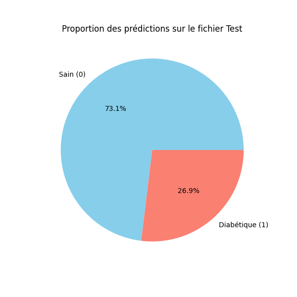

# Diabete Prediction

## Description
Le projet consiste à développer une pipeline de ML complète pour prédire si un patient est diabétique ou non.
Les données cliniques et comportementales sont nettoyées, normalisées puis passées dans un réseau de neurones (MLP) qui prédit la probabilité de diabète pour chaque patient.

## Technologies
- Python : Pipeline de traitement des données et entraînement du modèle
- TensorFlow / Keras : Construction et entraînement du réseau de neurones
- Scikit-learn : Prétraitement (StandardScaler, train_test_split)
- Pandas / NumPy : Manipulation des données
- Matplotlib / Seaborn : Visualisations

## Prérequis
- Python 3.8+
- pip

## Installation et exécution

1. Cloner le dépôt :
```powershell
git clone <url-du-repo>
cd <nom-du-repo>
```

2. Installer les dépendances :
```powershell
pip install -r requirements.txt
```

3. Lancer le script :
```powershell
python main.py
```

Le script génère automatiquement les prédictions dans `predictions_test.csv`.

